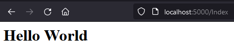

[home](../../index) | [blogs](../../blogs)

# Razor Pages with .NET 6's Minimal Api
## 2021/11/22

If you haven't been living under a rock the past few weeks you know the new .NET 6 has released!

One of the new features I've been playing with recently is the new minimal api setup.

The minimal api is easily scaffolded from the following command...

`dotnet new web -o minApi`

This generates a few files and one C# file, `Program.cs`, that we might recognize as a very paired back `Startup.cs`.


Running this using `dotnet run` (or even `dotnet watch` 😉) generates the all-too-familiar "Hello World" on the root url path.


But maybe we want to have a little api as well as a few nice razor pages? That is easily accomplished by adding only a couple lines of code...

```csharp
var builder = WebApplication.CreateBuilder(args);

builder.Services.AddRazorPages(opts => {
    opts.RootDirectory = "/Views";
});

var app = builder.Build();

app.MapRazorPages();

app.MapGet("/", () => "Hello World!");

app.Run();

```

One thing to remember is we don't have to map any additional routes as long as we're following the razor pages convention underneath the `Views` folder (This can be overridden as seen above).


We'll make a little Hello World page now with some html.

Index.cshtml

```html
@page
@model Views.Index

<h1>@Model.Message</h1>
```

Index.cshtml.cs

```csharp
namespace Views;

using Microsoft.AspNetCore.Mvc.RazorPages;

public class Index : PageModel
{
    public string? Message {get;set;}

    public void OnGet()
    {
        Message = "Hello World";
    }
}
```

Running this then gives us a big nice Hello World that only html could give.



And that's it. Pretty awesome. I won't use this for the scale of apps I usually work on but I think it's great the ASP.NET teams are looking at removing boilerplate, giving love to beginners, as well as easily supporting small sites. The script-like setup is very easy to conceptually understand and use as a springboard into bigger solutions.

Some other breakable toys I made with the minimal api can be found on my [minApi](https://github.com/jamesSampica/minApi) repository.